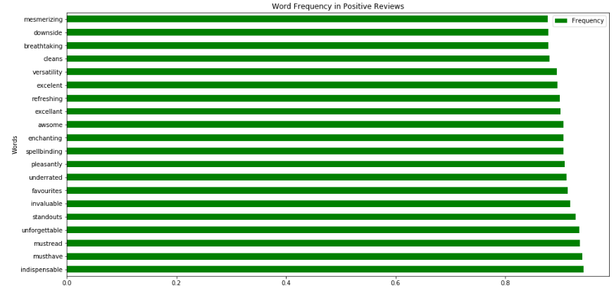

# Predicting-Sentiment-on-Amazon-Reviews

### Executive Summary
The data used in the task is from  Xiang Zhang's Google Drive dir:  amazon_review_full_csv.tar.gz https://drive.google.com/drive/folders/0Bz8a_Dbh9Qhbfll6bVpmNUtUcFdjYmF2SEpmZUZUcVNiMUw1TWN6RDV3a0JHT3kxLVhVR2M
  

### Pre-Processing Steps
- Removed 3 star Rating Reviews 
- Changed Ratings of 2 and Below to Negative Ratings and those that were 4 and above to Positive Ratings to do a Binary Classsification
- made sure Distribution of reviews was evenly spread between Positive and Negative so that the model can learn for both
- Removed stopwords and made each review lower case
- Tokenized each review
- indexed to give each word a corrosponding integer value 
- padded/truncated each review to ensure it is in correct format for the Neural Network
 - Distribution of Reviews

 - Positive Reviews

 - Negative Reviews

  

### Model
- Used Pytorch to build my Neural Network and used an LSTM layer as is commonly used with Sentiment Analysis
- Also tried using CNN and RNN with Keras but found that the flexibility of building your Neural Network from scratch with Pytorch helped in getting the best accuracy and performance as compared to Keras
  
- Was able to get 90% accuracy in Predictions of Reviews
  

### Methodology

1. **Business Understanding**
    - Work as part of a team whos receives the scraped/collected Textual Data and performs Sentiement Anaylsis on it.
    - Primary customers are organisations who are trying to improve their general PR as well as methods to help identify sentiment on products and services in order to improve and develop audience engagement and understanding
   
2. **Data Understanding**  
    - Data is over 2 million Amazon reviews that are labled from 1-5
    - Removed Neutral reviews(rating 3) and made all reviews 4 and above as Positive(1) and 2 and below Negative(0)
     
3. **Data Preparation** 
    - Data Cleaning
    - Data Visualisations 
    - Reviews Pre-Processing:
      - lowercase texts, removed stopwords and punctuation
      - made dictionary of all unique vocabs and mapped them to an integer
      - used vocab dictionary to change words into corrosponding integer value based on dictionary
      - Padded/Truncated by adding 0, or removing exceeding words to ensure lenght of each review is the same
    
4. **Modelling**
    - Train/Validation/Split the Data
    - create a Batch loader to train the data in batches 
    - Built the Neural Network with Pytorch specifying each step
    - Hyperparameter tuning by changing the number of size of inputs, embedding dimensions, hidden layers and number of layers as well as number of epochs to train 
  
5. **Evaluation**
    - Choosing the best model
    - Running the test set on the best model
  
6. **Future Tasks**
    - Add a Webscraping script
    - perform a Confusion Matrix to see where model is making more errors(Positves or Negatives)
